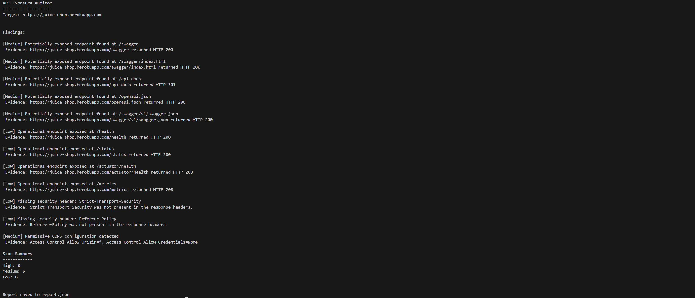

# API Exposure Auditor

API Exposure Auditor is a simple defensive security auditing tool written in Python.  
It scans a target API endpoint and reports common exposure and configuration risks.

This project was created as a learning exercise to better understand how APIs can unintentionally expose useful information to attackers.

The tool does **not attempt to exploit vulnerabilities**. Instead, it focuses on identifying common misconfigurations and exposure risks that may indicate a weaker security posture.

---

## Features

The scanner performs several basic checks:

- Detects exposed API documentation endpoints (Swagger, OpenAPI, etc.)
- Checks for missing HTTP security headers
- Identifies permissive CORS configurations
- Detects possible error message or debug information leakage
- Generates a simple JSON report with findings

Each finding includes:
- Severity level
- Description
- Evidence
- Recommended mitigation

---
## Security Checks Explained

The scanner performs several simple checks that can indicate potential API exposure risks.

### Exposed Documentation Endpoints

Many frameworks expose API documentation endpoints such as:

- `/swagger`
- `/api-docs`
- `/openapi.json`

If these endpoints are publicly accessible, attackers may be able to learn how the API works, including available routes, parameters, and request formats.

### Missing Security Headers

HTTP security headers help protect applications from common web attacks.

The scanner checks for headers such as:

- `Strict-Transport-Security`
- `X-Frame-Options`
- `X-Content-Type-Options`
- `Referrer-Policy`

Missing headers do not always indicate a vulnerability, but they can weaken the overall security posture of a service.

### Permissive CORS Configuration

Cross-Origin Resource Sharing (CORS) controls which domains are allowed to interact with an API.

If an API allows:

```markdown
`Access-Control-Allow-Origin: *`
```

any website may be able to interact with the API through a browser.  
In some cases this can enable cross-site data access risks.

### Error Message Leakage

Applications sometimes expose internal errors such as:

- stack traces
- framework names
- database errors

These messages can reveal useful information to attackers about the underlying system.

The scanner sends a request to a non-existent path and checks if the response leaks debugging information.

## Tech Stack

This project uses a small number of Python libraries:

- Python 3
- `requests` for HTTP requests
- `argparse` for command-line interface
- `json` for report generation

The goal was to keep the tool lightweight and easy to understand.

---
## Project Structure

```bash
api-exposure-auditor/
│
├── scanner.py # Main CLI entry point
├── checks.py # Security checks implementation
├── requirements.txt # Python dependencies
├── example_report.json # Example scan output
├── README.md
│
└── screenshots/
└── scan_example.png
```

## Installation

```markdown
Tested with Python 3.14.3
```

Clone the repository:

```bash
git clone https://github.com/YOUR_USERNAME/api-exposure-auditor.git
cd api-exposure-auditor
```

Create a virtual environment:

```bash
python -m venv .venv
```
Activate the virtual environment.

Windows:

```bash
.venv\Scripts\activate
```
Mac/Linux:

```bash
source .venv/bin/activate
```
Install required dependencies:

```bash
pip install -r requirements.txt
```
#### Common Installation Issue (Windows)

During development, Python was not initially detected in the terminal.
Running python --version produced an error.

Example:
```bash
Python was not found; run without arguments to install from the Microsoft Store

```
#### Cause

Python was installed but the Python executable was not added to the system PATH.

#### Solution

Reinstall Python and enable the Add Python to PATH option.

Steps:

1. Download Python from:
https://www.python.org/downloads/

2. Run the installer.

3. Enable the option:
```bash
☑ Add Python to PATH
```
4. Complete the installation.

5. Verify installation:
```bash
python --version
```
Expected output:
```bash
Python 3.x.x
```
After this, the virtual environment and dependencies can be installed normally.


### Usage

Run the scanner by providing a target API URL.

Example:
```bash
python scanner.py https://example.com

```

You can also specify an output file for the report:
```bash
python scanner.py https://example.com --output report.json
```


#### Example Output
```bash
API Exposure Auditor
--------------------
Target: https://example.com

Findings:

[Medium] Potentially exposed endpoint found at /swagger
 Evidence: https://example.com/swagger returned HTTP 200

[Low] Missing security header: X-Frame-Options
 Evidence: X-Frame-Options was not present in the response headers.

Scan Summary
------------
High: 0
Medium: 1
Low: 1

Report saved to report.json
```

#### Example JSON Report

The scanner also generates a JSON report for easier analysis.

Example structure:
```bash
{
  "scan_time": "2026-03-08T18:30:42",
  "total_findings": 2,
  "findings": [
    {
      "check": "docs_endpoints",
      "severity": "Medium",
      "title": "Potentially exposed endpoint found at /swagger",
      "evidence": "https://example.com/swagger returned HTTP 200",
      "recommendation": "Restrict public access to non-essential documentation endpoints."
    }
  ]
}
```
### Example Scan

Example scan performed against a public testing endpoint.



### Limitations

This tool is intentionally simple and does not perform deep vulnerability testing.

It does not:

- authenticate into applications

- perform brute force attacks

- exploit vulnerabilities

- test business logic flaws

- perform fuzzing

Instead, it focuses only on detecting a few common exposure and configuration issues.

### Ethical Use

This tool is intended for educational and defensive security purposes only.

Only scan systems that:

- you own, or

- you have explicit permission to test.

Unauthorized security testing may violate laws or acceptable use policies.

### Future Improvements

Possible improvements for this project include:

- scanning additional API endpoints

- adding rate-limit detection

- improving error message analysis

- exporting reports in additional formats

- adding concurrency for faster scans


## Author

**Mir Salman Nomaan**

Final-year BICT student at the University of Tasmania with an interest in cybersecurity and secure software development.

This project was created to explore common API security misconfigurations and to better understand how defensive security tools identify exposure risks.


GitHub: https://github.com/MISAN0  
LinkedIn: https://www.linkedin.com/in/nomaan00